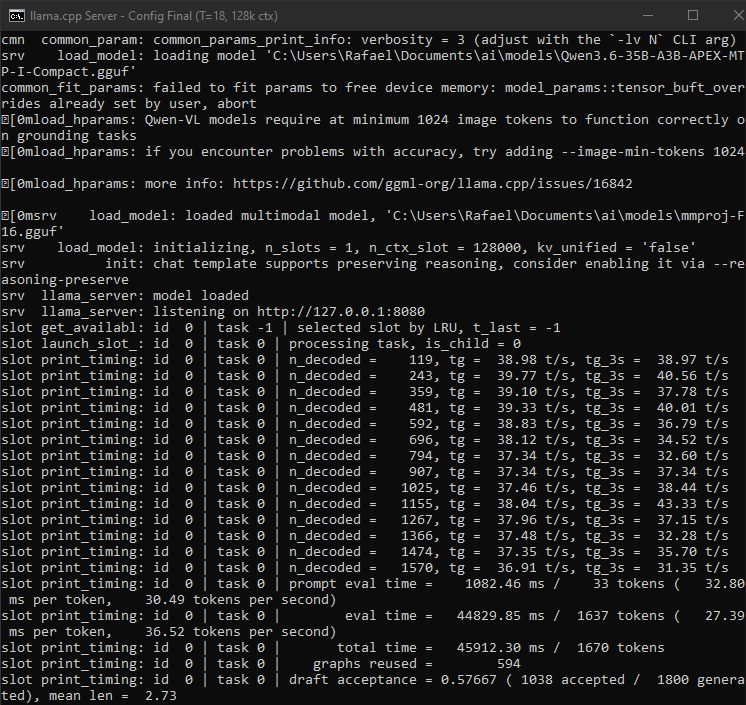

# llama-config
Best settings for my pc ( 3060 12gb + xeon 2650 v4 + 32gb DDR4

```batc
llama-server ^
-m "%MODEL_DIR%\Qwen3.6-35B-A3B-APEX-MTP-I-Compact.gguf" ^
--mmproj "%MODEL_DIR%\mmproj-F16.gguf" ^
-t 18 ^
-tb 12 ^
--n-cpu-moe 18 ^
-c 128000 ^
-b 2048 ^
-ub 512 ^
--fit on ^
--fit-target 2048 ^
--flash-attn on ^
--cache-type-k q4_0 ^
--cache-type-v q4_0 ^
--no-mmap ^
--mlock ^
--prio 2 ^
--prio-batch 2 ^
--perf ^
--no-log-prefix ^
--no-log-timestamps ^
--spec-type draft-mtp ^
-np 1
```
## Benchmark real (RTX 3060 12GB + Xeon 2650 v4)

| Métrica | Valor |

|---|---|

| Prompt processing | 30.49 tokens/s |

| Geração (eval) | 36.52 tokens/s |

| Draft acceptance | 57.7% |

| Mean draft length | 2.73 |

| Graphs reused | 594 |

| Contexto | 128k |

### Screenshot do benchmark



